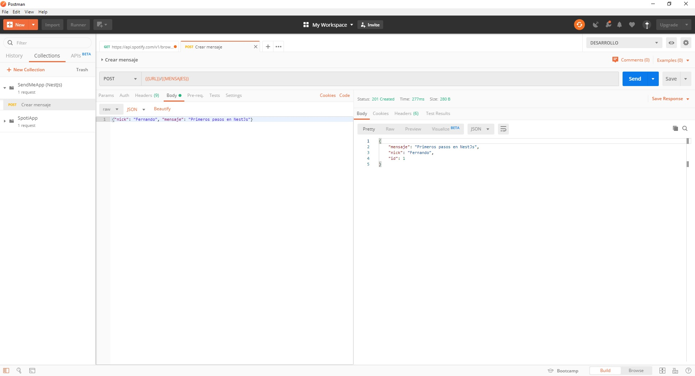
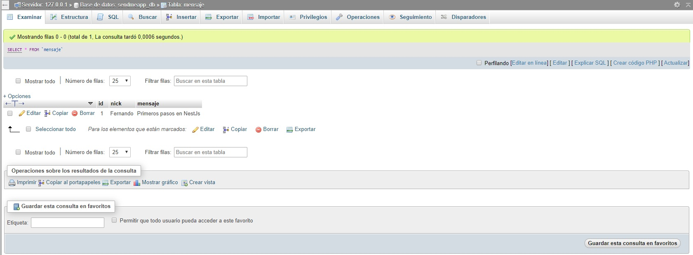
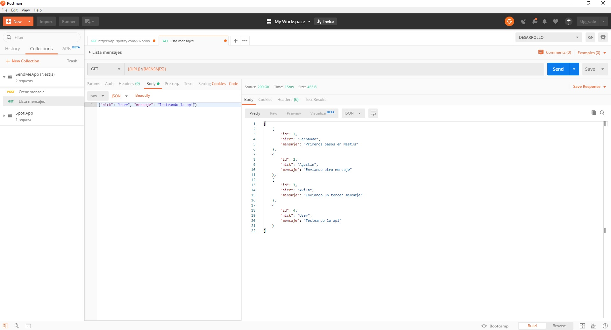
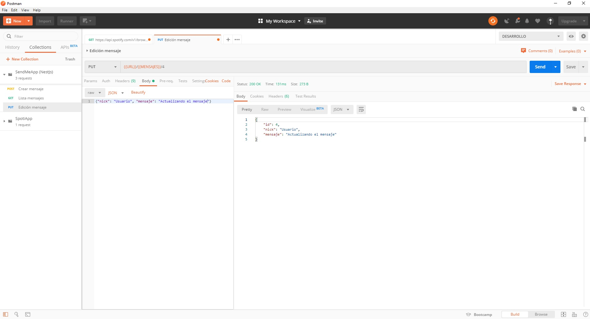
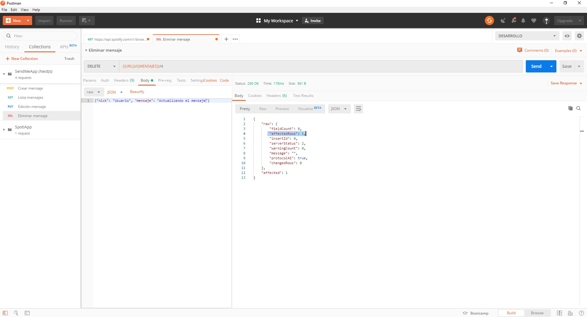
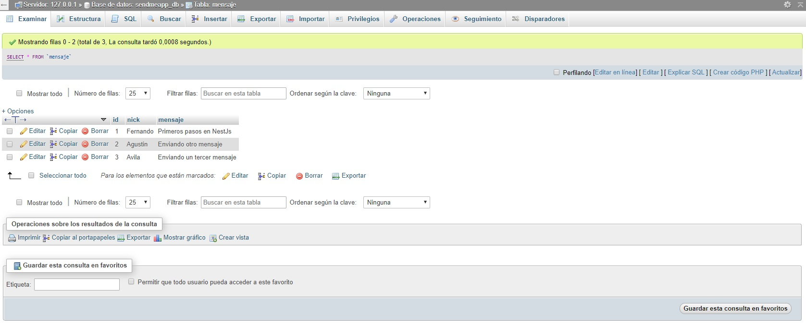

# Primer API
A través del uso del framework de NestJs logré crear mi primer API, con la metodología CRUD(Create, Read, Update, Delete).

Utilizando TypeScript. Además de:
- Apache
- Postman
- MySQL


## Vistas
Una mini presentación y muestra de lo que logré realizar. Capturas a la aplicación de Postman y de la base de datos que provee XAMPP, MySQL.

### Creación del primer mensaje
Create
 


### Visualización en la base de datos
BD
 

### Obtención 
Read
 

### Actualización de mensaje
Update
 

### Eliminación de mensaje
Delete
 


### Obtención luego de eliminación
Read
 

### Base de datos final
Una visualización de la base de datos final
 


<p align="center">
  <a href="http://nestjs.com/" target="blank"></a>
</p>

[travis-image]: https://api.travis-ci.org/nestjs/nest.svg?branch=master
[travis-url]: https://travis-ci.org/nestjs/nest
[linux-image]: https://img.shields.io/travis/nestjs/nest/master.svg?label=linux
[linux-url]: https://travis-ci.org/nestjs/nest
  
  <p align="center">A progressive <a href="http://nodejs.org" target="blank">Node.js</a> framework for building efficient and scalable server-side applications, heavily inspired by <a href="https://angular.io" target="blank">Angular</a>.</p>
    
## Description

[Nest](https://github.com/nestjs/nest) framework TypeScript starter repository.

## Installation

```bash
$ npm install
```

## Running the app

```bash
# development
$ npm run start

# watch mode
$ npm run start:dev

# production mode
$ npm run start:prod
```

## Test

```bash
# unit tests
$ npm run test

# e2e tests
$ npm run test:e2e

# test coverage
$ npm run test:cov
```
